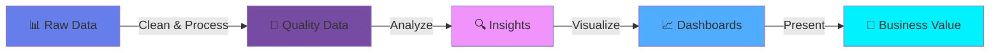

<!-- ====================================== -->
<!-- 👨‍💻 ABOUT ME SECTION - ENHANCED VERSION -->
<!-- ====================================== -->

<div align="center">
  
##  About Me

</div>

<br/>

<table>
<tr>
<td width="50%">

### 🚀 Who Am I?

```yaml
name: Mohamed Darwish
role: Data Analyst
location: Egypt 🇪🇬
motto: "Turning Coffee ☕ Into Code and Data Into Insights 📊"

mission: |
  Transform complex data into clear, 
  actionable insights that drive 
  business decisions.

status:
  learning: [ Machine Learning, Deep Learning ]
  working_on: [ Data Pipelines, Automation ]
  looking_for: [ Collaboration, Opportunities ]
  
contact:
  email: mdarwiish009@gmail.com
  linkedin: mohamed-darwish1337
  available: true
```

</td>
<td width="50%">


### 📈 Current Stats


### 💡 Fun Facts

- 🌙 Night owl - Best code at 2 AM
- ☕ Coffee addict - 5 cups/day average
- 📚 Lifelong learner - Always exploring
- 🎯 Goal-driven - Data-obsessed

</td>
</tr>
</table>

---

<div align="center">

### 🎯 What I'm Up To

<table>
  <tr>
    <td align="center" width="33%">
      <br/>
      <b>Learning</b><br/>
      <sub>Advanced ML Algorithms<br/>Deep Learning with PyTorch<br/>NLP & Text Analytics</sub>
    </td>
    <td align="center" width="33%">
      <br/>
      <b>Working On</b><br/>
      <sub>Real-time Dashboards<br/>Predictive Analytics<br/>Automated Reports</sub>
    </td>
    <td align="center" width="33%">
      <br/>
      <b>Looking For</b><br/>
      <sub>Data Science Projects<br/>Open Source Contrib.<br/>Freelance Work</sub>
    </td>
  </tr>
</table>

</div>

---

<div align="center">

### 🎨 My Data Journey



</div>

---

<details>
<summary><b>📖 My Story (Click to Expand)</b></summary>
<br/>

<div align="center">


</div>

### 🌟 The Beginning

Started my journey in data analysis with a passion for finding patterns in chaos. What began as curiosity about "why things happen" evolved into a full-fledged career in turning data into actionable insights.

### 📚 Education & Growth

- 🎓 Completed multiple certifications in Data Science
- 📊 Mastered SQL, Python, and visualization tools
- 🤖 Currently exploring Machine Learning and AI
- 🚀 Always learning, always growing

### 💼 Professional Experience

Working on diverse projects ranging from:
- Business Intelligence Dashboards
- Predictive Analytics Models
- Data Pipeline Automation
- Statistical Analysis & Reporting

### 🎯 What Drives Me

> "The goal is to turn data into information, and information into insight."
> 
> *— Carly Fiorina*

I'm passionate about making data accessible and understandable for everyone. Whether it's a complex ML model or a simple visualization, the aim is always the same: **clarity and impact**.

</details>

---

<div align="center">

### 💬 Ask Me About


</div>

---

<div align="center">

### 📫 How to Reach Me

<a href="mailto:mdarwiish009@gmail.com">
  
</a>
<a href="https://www.linkedin.com/in/mohamed-darwish1337">
  
</a>
<a href="https://github.com/darwiish1337">
  
</a>

<br/><br/>


**💡 "I don't just analyze data — I tell its story."** 📊✨


</div>
